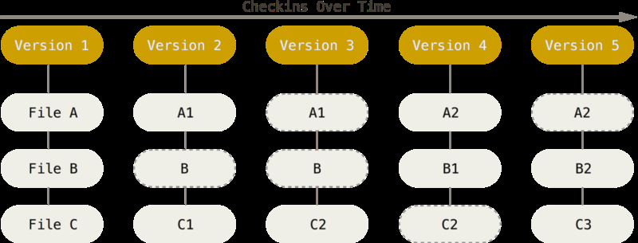
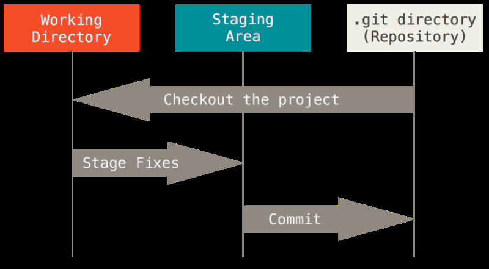
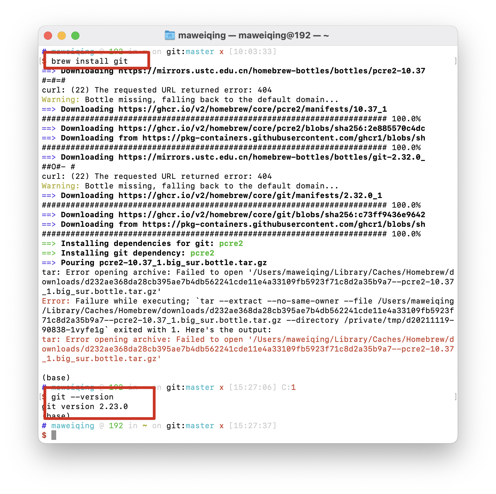

## 一、Git 起源

Git 是一个分布式版本控制系统，缔造者是大名鼎鼎的林纳斯·托瓦茲 (Linus Torvalds)，Git 最初的目的是为了能更好的管理 Linux 内核源码。


大家都知道，Linux 内核是开源的，参与者众多，到目前为止，共有两万多名开发者给 Linux Kernel 提交过代码。

但在 1991 年到 2002 年期间，Linus 作为项目的管理员并没有借助任何配置管理工具，而是以手工方式通过 patch 来合并大家提交的代码。

倒不是说 Linus 喜欢手工处理，而是因为他对代码版本管理工具非常挑剔，无论是商用的 clearcase，还是开源的 CVS、SVN 都入不了他的法眼。

直到 2002 年，Linus 才相中了一款分布式版本控制系统 BitKeeper，虽然是商用的，但 BitKeeper 愿意让 Linux 社区免费使用，这让 Linus 非常开心和满意。

时间来到 2005 年，由于 BitKeeper 提供的默认接口不能满足 Linux 社区用户的全部需要，一位开发者在未经允许的情况下反编译了 BitKeeper 并利用了未公开的接口，于是 BitKeeper 的著作权拥有者拉里·麦沃伊就气愤地收回了 Linux 社区免费使用的权力。

没办法，Linus 只好自己硬着头皮上了。他对新的版本控制系统制订了若干目标：

- 速度
- 设计简单
- 允许成千上万个并行开发的分支
- 完全分布式
- 有能力高效管理类似 Linux 内核一样的超大规模项目

结果，令人意想不到的是，Linus 只用了 10 天时间就用 C语言完成了第一个版本，嗯。。神就是神。并且给这个版本起了一个略带嘲讽意味的名字——Git（在英式英语俚语中表示“不愉快的人”）。

源代码的自述文件有进一步的阐述：

>The name "git" was given by Linus Torvalds when he wrote the very first version. He described the tool as "the stupid content tracker" and the name as (depending on your way)

从 Git 的设计上来看，有两种命令：分别是底层命令(Plumbing commands)和高层命令(Porcelain commands)。一开始，Linus 只设计了一些给开源社区的黑客们使用的符合 Unix KISS 原则的命令，因为黑客们本身就是动手高手，水管坏了就撸起袖子去修理，因此这些命令被称为 plumbing commands。

Linus 在提交了第一个 git commit 后，就向社区发布了 git 工具。当时，社区中有位叫 Junio Hamano 的开发者觉得这个工具很有意思，便下载了代码，结果发现一共才 1244 行代码，这更令他惊奇，也引发了极大的兴趣。Junio 在邮件列表与 Linus 交流并帮助增加了 merge 等功能，而后持续打磨 git，最后 Junio 完全接手了 Git 的维护工作，Linus 则回去继续维护 Linux Kernel 项目。

Junio Hamano 觉得 Linus 设计的这些命令对于普通用户不太友好，因此在此之上，封装了更易于使用、接口更精美的高层命令，也就是我们今天每天使用的 git add, git commit 之类。Git add 就是封装了 update-cache 命令，而 git commit 就是封装了 write-tree, commit-tree 命令。

如果选历史上最伟大的一次 Git 代码提交，那一定是这 Git 工具项目本身的第一次代码提交。这次代码提交无疑是开创性的，**如果说 Linux 项目促成了开源软件的成功并改写了软件行业的格局，那么 Git 则是改变了全世界开发者的工作方式和写作方式**。

如今，Git 已经成为全球软件开发者的标配。


原本的 Git 只适用于 Unix/Linux 平台，但随着 Cygwin、msysGit 环境的成熟，以及 TortoiseGit 这样易用的GUI工具，Git 在 Windows 平台下也逐渐成熟。

>PS1：Cygwin 的主要目的是通过重新编译，将 POSIX 系统（例如Linux、BSD，以及其他Unix系统）上的软件移植到Windows上。

>PS2：msysGit 前面的 4 个字幕来源于 MSYS 项目，而 MSYS 又源于 MinGW（Minimalist GNU for Windows，最简GNU工具集），通过增加了一个由bash提供的shell环境以及其他相关工具软件，组成了一个最简系统（Minimal System），利用MinGW提供的工具，以及Git针对MinGW的一个分支版本，可以在Windows平台为Git编译出一个原生应用，结合MSYS就组成了msysGit。

Git 和传统的版本控制工具 CVS、SVN 有不小的区别，前者关心的是文件的整体性是否发生了改变，后两者更关心文件内容上的差异。



除此之外，Git 更像是一个文件系统，每个使用它的主机都可以作为版本库，并且不依赖于远程仓库而离线工作。开发者在本地就有历史版本的副本，因此就不用再被远程仓库的网络传输而束缚。

Git 中的绝大多数操作都只需要访问本地文件和资源，一般不需要来自网络上其它计算机的信息。因为在本地磁盘上就有项目的完整历史，所以 Git 的大部分操作看起来就像是在瞬间完成的。

在多人协作的情况下，Git 可以将本地仓库复制给其他开发者，那些发生改变的文件可以作为新增的分支被导入，再与本地仓库的进行分支合并。

如果你希望后面的学习更顺利，请记住 Git 这三种状态：

- 已提交（committed），表示数据已经安全的保存在本地数据库中
- 已修改（modified），表示修改了文件，但还没保存到数据库中
- 已暂存（staged），表示对一个已修改文件的当前版本做了标记，使之包含在下次提交的快照中

由此引入了 Git 的三个工作区域：

- Git 仓库，用来保存项目的元数据和对象数据库
- 工作目录，对项目的某个版本进行独立提取
- 暂存区域，保存了下次将提交的文件列表信息，也可以叫“索引”

Git 的工作流程是这样的：



- 在工作目录中修改文件
- 暂存文件，将文件的快照放入暂存区域
- 提交更新，找到暂存区域的文件，将快照永久性存储到 Git 仓库目录

## 二、Git 安装

接下来，我们来看一下 **Git 的安装**，Linux 和 Windows 系统的安装大家可以到 Git 官网上查看安装方法，上面讲的非常详细。

><https://git-scm.com/downloads>


macOS 系统，可以直接使用 `brew install git` 命令安装，非常方便。



安装成功后，再使用 `git --version` 就可以查看版本号了，我本机上安装的是 2.23.0 版本。

## 三、Git 的数据模型

尽管 Git 的接口有些难懂，但它底层的设计和思想却非常的优雅。难懂的接口只能靠死记硬背，但优雅的底层设计则非常容易理解。我们可以通过一种自底向上的方式来学习 Git，先了解底层的数据模型，再学习它的接口。可以这么说，一旦搞懂了 Git 的数据模型，再学习它的接口并理解这些接口是如何操作数据模型的就非常容易了。

进行版本控制的方法很多，Git 拥有一个精心设计的模型，这使其能够支持版本控制所需的所有特性，比如维护历史记录、支持分支和团队协作。

### 快照

Git 将顶级目录中的文件和文件夹称作集合，并通过一系列快照来管理历史记录。在 Git 的术语中，文件被称为 blob 对象（数据对象），也就是一组数据。目录则被称为 tree（树），目录中可以包含文件和子目录。

```
<root> (tree)
|
+- foo (tree)
|  |
|  + bar.txt (blob, contents = "hello world")
|
+- baz.txt (blob, contents = "git is wonderful")
```

顶层的树（也就是 root） 包含了两个元素，一个名为 foo 的子树（包含了一个 blob 对象“bar.txt”），和一个 blob 对象“baz.txt”。

### 历史记录建模：关联快照

版本控制系统是如何和快照进行关联的呢？线性历史记录是一种最简单的模型，它包含了一组按照时间顺序线性排列的快照。不过，出于种种原因，Git 没有采用这种模型。

在 Git 中，历史记录是一个由快照组成的有向无环图。“有向无环图”，听起来很高大上，但其实并不难理解。我们只需要知道这代表 Git 中的每个快照都有一系列的父辈，也就是之前的一系列快照。这些快照通常被称为“commit”，看起来好像是下面这样：

```
o <-- o <-- o <-- o
            ^  
             \
              --- o <-- o
```

o 表示一次 commit，也就是一次快照。箭头指向了当前 commit 的父辈。在第三次 commit 之后，历史记录分叉成了两条独立的分支，这可能是因为要同时开发两个不同的特性，它们之间是相互独立的。开发完成后，这些分支可能会被合并为一个新的 commit，这个新的 commit 会同时包含这些特性，看起来好像是下面这样：

```
o <-- o <-- o <-- o <---- o
            ^            /
             \          v
              --- o <-- o
```

Git 中的 commit 是不可改变的。当然了，这并不意味着不能被修改，只不过这种“修改”实际上是创建了一个全新的提交记录。

### 数据模型及其伪代码表示

以伪代码的形式来学习 Git 的数据模型，可能更加通俗易懂。

```
// 文件是一组数据
type blob = array<byte>

// 一个包含了文件和子目录的目录
type tree = map<string, tree | file>

// 每个 commit 都包含了一个父辈，元数据和顶层树
type commit = struct {
    parent: array<commit> // 父辈
    author: string // 作者
    message: string // 信息
    snapshot: tree // 快照
}
```

### 对象和内存寻址

Git 中的对象可以是 blob、tree 或者 commit：

```
type object = blob | tree | commit
```

Git 在存储数据的时候，所有的对象都会基于它们的安全散列算法进行寻址。

```
objects = map<string, object>

def store(object):
    id = sha1(object)
    objects[id] = object

def load(id):
    return objects[id]
```

blob、tree 和 commit 一样，都是对象。当它们引用其他对象时，并没有真正在硬盘上保存这些对象，而是仅仅保存了它们的哈希值作为引用。

还记得之前的例子吗？

```
<root> (tree)
|
+- foo (tree)
|  |
|  + bar.txt (blob, contents = "hello world")
|
+- baz.txt (blob, contents = "git is wonderful")
```

root 引用的 foo 和 baz.txt 就像下面这样：

```
100644 blob 4448adbf7ecd394f42ae135bbeed9676e894af85    baz.txt
040000 tree c68d233a33c5c06e0340e4c224f0afca87c8ce87    foo
```

### 引用

所有的快照都可以通过它们的哈希值来标记，但 40 位的十六进制字符实在是太难记了，很不方便。针对这个问题，Git 的解决办法是给这些哈希值赋予一个可读的名字，也就是引用（reference），引用是指向 commit 的指针，与对象不同，它是可变的，可以被更新，指向新的 commit。通常，master 引用通常会指向主分支的最新一次 commit。

```
references = map<string, string>

def update_reference(name, id):
    references[name] = id

def read_reference(name):
    return references[name]

def load_reference(name_or_id):
    if name_or_id in references:
        return load(references[name_or_id])
    else:
        return load(name_or_id)
```

这样，Git 就可以使用“master”这样容易被记住的名称来表示历史记录中特定的 commit，而不需要再使用一长串的十六进制字符了。

在 Git 中，当前的位置有一个特殊的索引，它就是“HEAD”。

### 仓库

我们可以粗略地给出 Git 仓库的定义了：对象 和 引用。

在硬盘上，Git 仅存储对象和引用，因为其数据模型仅包含这些东西。所有的 git 命令都对应着对 commit 树的操作。

## 四、Git 的内容实现

学习 Git 的内部实现，最好的办法是看 Linus 最初的代码提交，checkout 出 Git 项目的第一次提交节点，可以看到代码库中只有几个文件：一个 README，一个构建脚本 Makefile，剩下几个 C 源文件。这次 commit 的备注写的也非常特别：

```
commit e83c5163316f89bfbde7d9ab23ca2e25604af290
Author: Linus Torvalds <torvalds@ppc970.osdl.org>
Date:   Thu Apr 7 15:13:13 2005 -0700

    Initial revision of "git", the information manager from hell
```

在 README 中，Linus 详细描述了 Git 的设计思路。看似复杂的 Git 工作，在 Linus 的设计里，只有两种对象抽象：

- 对象数据库(“object database”)；
- 当前目录缓存(“current directory cache”)。

Git 的本质就是一系列的文件对象集合，代码文件是对象、文件目录树是对象、commit 也是对象。这些文件对象的名称即内容的 SHA1 值，SHA1 哈希算法的值为 40 位。Linus 将前二位作为文件夹、后 38 位作为文件名。大家可以在 .git 目录里的 objects 里看到有很多两位字母/数字名称的目录，里面存储了很多 38 位 hash 值名称的文件，这就是 Git 的所有信息。

Linus 在设计对象的数据结构时按照 <标签ascii码表示>(blob/tree/commit) + <空格> + <长度ascii码表示> + <\0> + <二进制数据内容> 来定义，大家可以用 xxd 命令看下 objects 目录里的对象文件(需 zlib 解压)，比如一个 tree 对象文件内容如下：

```
00000000: 7472 6565 2033 3700 3130 3036 3434 2068  tree 37.100644 h
00000010: 656c 6c6f 2e74 7874 0027 0c61 1ee7 2c56  ello.txt.'.a..,V
00000020: 7bc1 b2ab ec4c bc34 5bab 9f15 ba      
```

对象有三种：BLOB、TREE、CHANGESET。

BLOB: 即二进制对象，这就是 Git 存储的文件，Git 不像某些 VCS （如 SVN）那样存储变更 delta 信息，而是存储文件在每一个版本的完全信息。

比如先提交了一份 hello.c 进入了 Git 库，会生成一个 BLOB 文件完整记录 hello.c 的内容；对 hello.c 修改后，再提交 commit，会再生成一个新的 BLOB 文件记录修改后的 hello.c 全部内容。

Linus 在设计时，BLOB 中仅记录文件的内容，而不包含文件名、文件属性等元数据信息，这些信息被记录在第二种对象 TREE 里。

TREE: 目录树对象。在 Linus 的设计里，TREE 对象就是一个时间切片中的目录树信息抽象，包含了文件名、文件属性及 BLOB 对象的 SHA1 值信息，但没有历史信息。这样的设计好处是可以快速比较两个历史记录的 TREE 对象，不能读取内容，而根据 SHA1 值显示一致和差异的文件。

另外，由于 TREE 上记录文件名及属性信息，对于修改文件属性或修改文件名、移动目录而不修改文件内容的情况，可以复用 BLOB 对象，节省存储资源。而 Git 在后来的开发演进中又优化了 TREE 的设计，变成了某一时间点文件夹信息的抽象，TREE 包含其子目录的 TREE 的对象信息（SHA1）。这样，对于目录结构很复杂或层级较深的 Git 库 可以节约存储资源。历史信息被记录在第三种对象 CHANGESET 里。


CHANGESET：即 Commit 对象。一个 CHANGESET 对象中记录了该次提交的 TREE 对象信息（SHA1），以及提交者(committer)、提交备注(commit message)等信息。

跟其他 SCM（软件配置管理）工具所不同的是，Git 的 CHANGESET 对象不记录文件重命名和属性修改操作，也不会记录文件修改的 Delta 信息等，CHANGESET 中会记录父节点 CHANGESET 对象的 SHA1 值，通过比较本节点和父节点的 TREE 信息来获取差异。

Linus 在设计 CHANGESET 父节点时允许一个节点最多有 16 个父节点，虽然超过两个父节点的合并是很奇怪的事情，但实际上，Git 是支持超过两个分支的多头合并的。

Linus 在三种对象的设计解释后着重阐述了可信(TRUST)：虽然 Git 在设计上没有涉及可信的范畴，但 Git 作为配置管理工具是可以做到可信的。原因是所有的对象都以 SHA1 编码（Google 实现 SHA1 碰撞攻击是后话，且 Git 社区也准备使用更高可靠性的 SHA256 编码来代替），而签入对象的过程可信靠签名工具保证，如 GPG 工具等。

理解了 Git 的三种基本对象，那么对于 Linus 对于 Git 初始设计的“对象数据库”和“当前目录缓存”这两层抽象就很好理解了。加上原本的工作目录，Git 有三层抽象，如下图示：一个是当前工作区(Working Directory)，也就是我们查看/编写代码的地方，一个是 Git 仓库(Repository)，即 Linus 说的对象数据库，我们在 Git 仓看到的 .git 文件夹中存储的内容，Linus 在第一版设计时命名为 .dircache，在这两个存储抽象中还有一层中间的缓存区（Staging Area），即 .git/index 里存储的信息，我们在执行 git add 命令时，便是将当前修改加入到了缓存区。

Linus 解释了“当前目录缓存”的设计，该缓存就是一个二进制文件，内容结构很像 TREE 对象，与 TREE 对象不同的是 index 不会再包含嵌套 index 对象，即当前修改目录树内容都在一个 index 文件里。这样设计有两个好处：

- 1. 能够快速的复原缓存的完整内容，即使不小心把当前工作区的文件删除了，也可以从缓存中恢复所有文件；
- 2. 能够快速找出缓存中和当前工作区内容不一致的文件。


Linus 在 Git 的第一次代码提交里便完成了 Git 的最基础功能，并可以编译使用。代码极为简洁，加上 Makefile 一共只有 848 行。感兴趣的话可以通过上一段所述方法 checkout Git 最早的 commit 上手编译玩玩，只要有 Linux 环境即可。

因为依赖库版本的问题，需要对原始 Makefile 脚本做些小修改。Git 第一个版本依赖 openssl 和 zlib 两个库，需要手工安装这两个开发库。在 ubuntu 上执行： sudo apt install libssl-dev libz-dev ；然后修改 makefile 在 LIBS= -lssl 行 中的 -lssl 改成 -lcrypto 并增加 -lz ；最后执行 make，忽略编译告警，会发现编出了7个可执行程序文件：init-db, update-cache, write-tree, commit-tree, cat-file, show-diff 和 read-tree。

下面分别简要介绍下这些可执行程序的实现：

- init-db: 初始化一个 git 本地仓库，这也就是我们现在每次初始化建立 git 库式敲击的 git init 命令。只不过一开始 Linus 建立的仓库及 cache 文件夹名称叫 .dircache，而不是我们现在所熟知的 .git 文件夹。
- update-cache: 输入文件路径，将该文件（或多个文件）加入缓冲区中。具体实现是：校验路径合法性，然后将文件计算 SHA1值，将文件内容加上 blob 头信息进行 zlib 压缩后写入到对象数据库(.dircache/objects)中；最后将文件路径、文件属性及 blob sha1 值更新到 .dircache/index 缓存文件中。
- write-tree: 将缓存的目录树信息生成 TREE 对象，并写入对象数据库中。TREE 对象的数据结构为：‘tree ‘ + 长度 + \0 + 文件树列表。文件树列表中按照 文件属性 + 文件名 + \0 + SHA1 值结构存储。写入对象成功后，返回该 TREE 对象的 SHA1 值。
- commit-tree: 将 TREE 对象信息生成 commit 节点对象并提交到版本历史中。具体实现是输入要提交的 TREE 对象 SHA1 值，并选择输入父 commit 节点（最多 16个），commit 对象信息中包含 TREE、父节点、committer 及作者的 name、email及日期信息，最后写入新的 commit 节点对象文件，并返回 commit 节点的 SHA1 值。
- cat-file: 由于所有的对象文件都经过 zlib 压缩，因此想要查看文件内容的话需要使用这个工具来解压生成临时文件，以便查看对象文件的内容。
- show-diff: 快速比较当前缓存与当前工作区的差异，因为文件的属性信息（包括修改时间、长度等）也保存在缓存的数据结构中，因此可以快速比较文件是否有修改，并展示差异部分。
- read-tree: 根据输入的 TREE 对象 SHA1 值输出打印 TREE 的内容信息。

这就是第一个可用版本的 Git 的全部七个子程序，可能用过 Git 的小伙伴会说：这怎么跟我常用的 Git 命令不一样呢？Git add, git commit 呢？是的，在最初的 Git 设计中是没有我们这些平常所使用的 git 命令的。

在 Git 的设计中，有两种命令：分别是底层命令(Plumbing commands)和高层命令(Porcelain commands)。一开始，Linus 就设计了这些给开源社区黑客使用的符合 Unix KISS 原则的命令，因为黑客们本身就是动手高手，水管坏了就撸起袖子去修理，因此这些命令被称为 plumbing commands。

后来接手 Git 的 Junio Hamano 觉得这些命令对于普通用户不太友好，因此在此之上，封装了更易于使用、接口更精美的高层命令，也就是我们今天每天使用的 git add, git commit 之类。Git add 就是封装了 update-cache 命令，而 git commit 就是封装了 write-tree, commit-tree 命令。

## 五、Git 的 60 个常用命令

虽然每天多多少少都会敲一些 Git 命令，但仍然有很多记不住，可怜我这脑袋瓜子了。。

一般来说，日常使用只要记住下图中这 6 个命令就可以了，但是熟练使用 Git，恐怕要记住60～100个命令~


在 Git 专题的[开篇](https://mp.weixin.qq.com/s/hzEnH3ThvuRDW4EeBLlumw)，我就提醒大家一定要记住这几个专用名词，对掌握 Git 有很大的帮助：

- Workspace：工作区
- Index / Stage：暂存区
- Repository：仓库区（或本地仓库）
- Remote：远程仓库

当然了，没记住的话，也不要紧了，今天就趁机再温故一遍。

下面是阮一峰老师整理的常用 Git 命令清单，有必要的话，可以打印一份出来，放在工作台~

>[http://www.ruanyifeng.com/blog/2015/12/git-cheat-sheet.html](http://www.ruanyifeng.com/blog/2015/12/git-cheat-sheet.html)

### 1、新建代码库

```
# 在当前目录新建一个Git代码库
$ git init

# 新建一个目录，将其初始化为Git代码库
$ git init [project-name]

# 下载一个项目和它的整个代码历史
$ git clone [url]
```

### 2、配置

Git的配置文件为.gitconfig，它可以在用户主目录下（全局配置），也可以在项目目录下（项目配置）。

```
# 显示当前的Git配置
$ git config --list

# 编辑Git配置文件
$ git config -e [--global]

# 设置提交代码时的用户信息
$ git config [--global] user.name "[name]"
$ git config [--global] user.email "[email address]"
```

### 3、增加/删除文件

```
# 添加指定文件到暂存区
$ git add [file1] [file2] ...

# 添加指定目录到暂存区，包括子目录
$ git add [dir]

# 添加当前目录的所有文件到暂存区
$ git add .

# 添加每个变化前，都会要求确认
# 对于同一个文件的多处变化，可以实现分次提交
$ git add -p

# 删除工作区文件，并且将这次删除放入暂存区
$ git rm [file1] [file2] ...

# 停止追踪指定文件，但该文件会保留在工作区
$ git rm --cached [file]

# 改名文件，并且将这个改名放入暂存区
$ git mv [file-original] [file-renamed]
```

### 4、代码提交

```
# 提交暂存区到仓库区
$ git commit -m [message]

# 提交暂存区的指定文件到仓库区
$ git commit [file1] [file2] ... -m [message]

# 提交工作区自上次commit之后的变化，直接到仓库区
$ git commit -a

# 提交时显示所有diff信息
$ git commit -v

# 使用一次新的commit，替代上一次提交
# 如果代码没有任何新变化，则用来改写上一次commit的提交信息
$ git commit --amend -m [message]

# 重做上一次commit，并包括指定文件的新变化
$ git commit --amend [file1] [file2] ...
```

### 5、分支

```
# 列出所有本地分支
$ git branch

# 列出所有远程分支
$ git branch -r

# 列出所有本地分支和远程分支
$ git branch -a

# 新建一个分支，但依然停留在当前分支
$ git branch [branch-name]

# 新建一个分支，并切换到该分支
$ git checkout -b [branch]

# 新建一个分支，指向指定commit
$ git branch [branch] [commit]

# 新建一个分支，与指定的远程分支建立追踪关系
$ git branch --track [branch] [remote-branch]

# 切换到指定分支，并更新工作区
$ git checkout [branch-name]

# 切换到上一个分支
$ git checkout -

# 建立追踪关系，在现有分支与指定的远程分支之间
$ git branch --set-upstream [branch] [remote-branch]

# 合并指定分支到当前分支
$ git merge [branch]

# 选择一个commit，合并进当前分支
$ git cherry-pick [commit]

# 删除分支
$ git branch -d [branch-name]

# 删除远程分支
$ git push origin --delete [branch-name]
$ git branch -dr [remote/branch]
```

### 6、标签

```
# 列出所有tag
$ git tag

# 新建一个tag在当前commit
$ git tag [tag]

# 新建一个tag在指定commit
$ git tag [tag] [commit]

# 删除本地tag
$ git tag -d [tag]

# 删除远程tag
$ git push origin :refs/tags/[tagName]

# 查看tag信息
$ git show [tag]

# 提交指定tag
$ git push [remote] [tag]

# 提交所有tag
$ git push [remote] --tags

# 新建一个分支，指向某个tag
$ git checkout -b [branch] [tag]
```

### 7、查看信息

```
# 显示有变更的文件
$ git status

# 显示当前分支的版本历史
$ git log

# 显示commit历史，以及每次commit发生变更的文件
$ git log --stat

# 搜索提交历史，根据关键词
$ git log -S [keyword]

# 显示某个commit之后的所有变动，每个commit占据一行
$ git log [tag] HEAD --pretty=format:%s

# 显示某个commit之后的所有变动，其"提交说明"必须符合搜索条件
$ git log [tag] HEAD --grep feature

# 显示某个文件的版本历史，包括文件改名
$ git log --follow [file]
$ git whatchanged [file]

# 显示指定文件相关的每一次diff
$ git log -p [file]

# 显示过去5次提交
$ git log -5 --pretty --oneline

# 显示所有提交过的用户，按提交次数排序
$ git shortlog -sn

# 显示指定文件是什么人在什么时间修改过
$ git blame [file]

# 显示暂存区和工作区的差异
$ git diff

# 显示暂存区和上一个commit的差异
$ git diff --cached [file]

# 显示工作区与当前分支最新commit之间的差异
$ git diff HEAD

# 显示两次提交之间的差异
$ git diff [first-branch]...[second-branch]

# 显示今天你写了多少行代码
$ git diff --shortstat "@{0 day ago}"

# 显示某次提交的元数据和内容变化
$ git show [commit]

# 显示某次提交发生变化的文件
$ git show --name-only [commit]

# 显示某次提交时，某个文件的内容
$ git show [commit]:[filename]

# 显示当前分支的最近几次提交
$ git reflog
```

### 8、远程同步

```
# 下载远程仓库的所有变动
$ git fetch [remote]

# 显示所有远程仓库
$ git remote -v

# 显示某个远程仓库的信息
$ git remote show [remote]

# 增加一个新的远程仓库，并命名
$ git remote add [shortname] [url]

# 取回远程仓库的变化，并与本地分支合并
$ git pull [remote] [branch]

# 上传本地指定分支到远程仓库
$ git push [remote] [branch]

# 强行推送当前分支到远程仓库，即使有冲突
$ git push [remote] --force

# 推送所有分支到远程仓库
$ git push [remote] --all
```

### 9、撤销

```
# 恢复暂存区的指定文件到工作区
$ git checkout [file]

# 恢复某个commit的指定文件到暂存区和工作区
$ git checkout [commit] [file]

# 恢复暂存区的所有文件到工作区
$ git checkout .

# 重置暂存区的指定文件，与上一次commit保持一致，但工作区不变
$ git reset [file]

# 重置暂存区与工作区，与上一次commit保持一致
$ git reset --hard

# 重置当前分支的指针为指定commit，同时重置暂存区，但工作区不变
$ git reset [commit]

# 重置当前分支的HEAD为指定commit，同时重置暂存区和工作区，与指定commit一致
$ git reset --hard [commit]

# 重置当前HEAD为指定commit，但保持暂存区和工作区不变
$ git reset --keep [commit]

# 新建一个commit，用来撤销指定commit
# 后者的所有变化都将被前者抵消，并且应用到当前分支
$ git revert [commit]

# 暂时将未提交的变化移除，稍后再移入
$ git stash
$ git stash pop
```

### 10、其他

```
# 生成一个可供发布的压缩包
$ git archive
```

## 六、图解 Git 分支

相比同类软件，Git有很多优点。其中很显著的一点，就是版本的分支（branch）和合并（merge）十分方便。

有些传统的版本管理软件，分支操作实际上会生成一份现有代码的物理拷贝，而Git只生成一个指向当前版本（又称"快照"）的指针，因此非常快捷易用。

但是，太方便了也会产生副作用。如果你不加注意，很可能会留下一个枝节蔓生、四处开放的版本库，到处都是分支，完全看不出主干发展的脉络。


那有没有一个好的分支策略呢？答案当然是有的。

### 1、主分支Master

首先，代码库应该有一个、且仅有一个主分支。所有提供给用户使用的正式版本，都在这个主分支上发布。


Git主分支的名字，默认叫做Master。它是自动建立的，版本库初始化以后，默认就是在主分支在进行开发。

### 2、开发分支Develop

主分支只用来发布重大版本，日常开发应该在另一条分支上完成。我们把开发用的分支，叫做Develop。


这个分支可以用来生成代码的最新隔夜版本（nightly）。如果想正式对外发布，就在Master分支上，对Develop分支进行"合并"（merge）。

Git创建Develop分支的命令：

```
　　git checkout -b develop master
```

将Develop分支发布到Master分支的命令：

```
　　# 切换到Master分支
　　git checkout master

　　# 对Develop分支进行合并
　　git merge --no-ff develop
```

这里稍微解释一下上一条命令的--no-ff参数是什么意思。默认情况下，Git执行"快进式合并"（fast-farward merge），会直接将Master分支指向Develop分支。


使用--no-ff参数后，会执行正常合并，在Master分支上生成一个新节点。为了保证版本演进的清晰，我们希望采用这种做法。


### 3、临时性分支

前面讲到版本库的两条主要分支：Master和Develop。前者用于正式发布，后者用于日常开发。其实，常设分支只需要这两条就够了，不需要其他了。

但是，除了常设分支以外，还有一些临时性分支，用于应对一些特定目的的版本开发。临时性分支主要有三种：

- 功能（feature）分支
- 预发布（release）分支
- 修补bug（fixbug）分支

这三种分支都属于临时性需要，使用完以后，应该删除，使得代码库的常设分支始终只有Master和Develop。

接下来，一个个来看这三种"临时性分支"。

**第一种是功能分支**，它是为了开发某种特定功能，从Develop分支上面分出来的。开发完成后，要再并入Develop。


功能分支的名字，可以采用feature-*的形式命名。

创建一个功能分支：

```
　　git checkout -b feature-x develop
```

开发完成后，将功能分支合并到develop分支：

```
　　git checkout develop

　　git merge --no-ff feature-x
```

删除feature分支：

```
　　git branch -d feature-x
```  

**第二种是预发布分支**，它是指发布正式版本之前（即合并到Master分支之前），我们可能需要有一个预发布的版本进行测试。

预发布分支是从Develop分支上面分出来的，预发布结束以后，必须合并进Develop和Master分支。它的命名，可以采用release-*的形式。

创建一个预发布分支：

```
　　git checkout -b release-1.2 develop
```

确认没有问题后，合并到master分支：

```
　　git checkout master

　　git merge --no-ff release-1.2

　　# 对合并生成的新节点，做一个标签
　　git tag -a 1.2
```

再合并到develop分支：

```
　　git checkout develop

　　git merge --no-ff release-1.2
```

最后，删除预发布分支：

```
　　git branch -d release-1.2
```

**最后一种是修补bug分支**。软件正式发布以后，难免会出现bug。这时就需要创建一个分支，进行bug修补。

修补bug分支是从Master分支上面分出来的。修补结束以后，再合并进Master和Develop分支。它的命名，可以采用fixbug-*的形式。


创建一个修补bug分支：

```
　　git checkout -b fixbug-0.1 master
```

修补结束后，合并到master分支：

```
　　git checkout master

　　git merge --no-ff fixbug-0.1

　　git tag -a 0.1.1
```

再合并到develop分支：

```
　　git checkout develop

　　git merge --no-ff fixbug-0.1
```

最后，删除"修补bug分支"：

```
　　git branch -d fixbug-0.1
```  

## 七、Git 实战

对于新手来说，Git 操作确实容易给代码的版本库带来一些不必要的混乱，毕竟大学的时候，学习的重点在编程语言上，在计算机基础上。可一旦参加了工作，就必须得在代码版本库上狠下一番功夫了，毕竟要多人运动啊，不，多人协作啊。

### 1、创建仓库

仓库，也就是 repository，可以简单理解为一个目录，这个目录里面的所有文件都将被 Git 管理起来，每个文件的一举一动，都将被 Git 记录下来，以便在任何时刻进行追踪和回滚。

新建一个文件夹，比如说 testgit，然后使用 `git init` 命令就可以把这个文件夹初始化为 Git 仓库了。


初始化Git 仓库成功后，可以看到多了一个 .git 的目录，没事不要乱动，免得破坏了 Git 仓库的结构。

接下来，我们来新增一个文件 readme.txt，内容为“老铁，记得给二哥三连啊”，并将其提交到 Git 仓库。

第一步，使用 `git add` 命令将新增文件添加到暂存区。

第二步，使用 `git commit` 命令告诉 Git，把文件提交到仓库。


可以使用 `git status` 来查看是否还有文件未提交。

也可以在文件中新增一行内容“传统美德不能丢，记得点赞哦~”，再使用 `git status` 来查看结果。


如果想查看文件到底哪里做了修改，可以使用 `git diff` 命令：


确认修改的内容后，可以使用 `git add` 和 `git commit` 再次提交。

### 2、版本回滚

再次对文件进行修改，追加一行内容为：“xxx，我爱你❤”，并且提交到 Git 仓库。

现在我已经对 readme.txt 文件做了三次修改了。可以通过 `git log` 命令来查看历史记录：


也可以通过 `gitk` 这个命令来启动图形化界面来查看版本历史。


如果想回滚的话，比如说回滚到上一个版本，可以执行以下两种命令：

1）`git reset --hard HEAD^`，上上个版本就是 `git reset --hard HEAD^^`，以此类推。

2）`git reset --hard HEAD~100`，如果回滚到前 100 个版本，用这个命令比上一个命令更方便。


那假如回滚错了，想恢复，不记得版本号了，可以先执行 `git reflog` 命令查看版本号：


然后再通过 `git reset --hard` 命令来恢复：


### 3、工作区和暂存区的区别

工作区和暂存区的概念其实在前面的章节里强调过了，但考虑到有些小伙伴在 `git add` 和 `git commit` 命令之间仍然有一些疑惑，我们这里就再强调一次——学习知识就是这样，只有不厌其烦地重复，才能真正地理解和掌握。

1）**工作区**，比如说前面提到的 testgit 目录就属于工作区，我们操作的 readme.txt 文件就放在这个里面。

2）**暂存区**，隐藏目录 .git 不属于工作区，它（Git 仓库）里面存了很多东西，其中最重要的就是暂存区。

Git 在提交文件的时候分两步，第一步 `git add` 命令是把文件添加到暂存区，第二步 `git commit` 才会把暂存区的所有内容提交到 Git 仓库中。

“**为什么要先 add 才能 commit 呢？**”

最直接的原因就是Linus 搞了这个“暂存区”的概念。那为什么要搞这个概念呢？没有暂存区不行吗？

嗯，要回答这个问题，我们就需要追本溯源了。

在 Git 之前， SVN 是代码版本管理系统的集大成者。SVN 比之前的 CVS 更优秀的一点是，每次的提交可以由多个文件组成，并且这次提交是原子性的，要么全部成功，要么全部失败。

原子性带来的好处是显而易见的，这使得我们可以把项目整体还原到某个时间点，就这一点，SVN 就完虐 CVS 这些代码版本管理系统了。


Git 作为逼格最高的代码版本管理系统，自然要借鉴 SVN 这个优良特性的。但不同于 SVN 的是，Git 一开始搞的都是命令行，没有图形化界面，如果想要像 SVN 那样一次性选择多个文件或者不选某些文件（见上图），还真特喵的是个麻烦事。

对于像 Linus 这种天才级选手来说，图形化界面无疑是 low 逼，可命令行在这种情况下又实在是麻烦~

嗯，怎么办呢？

神之所以为神，就是他能在遇到问题的时候想到完美的解决方案——搞个**暂存区**不就完事了？

暂存区可以随意地将各种文件的修改放进去，只需要通过 `git add` 这种简单的命令就可以精心地挑选要提交哪些文件了，然后再一次性（原子性）的 `git commit` 到版本库，所有的问题都迎刃而解嘛。

我们在 testgit 目录下再新增一个文件 readyou.txt，内容为“二哥，我要和你约饭~~~”；并且在 readme.txt 文件中再追加一行内容“点赞、在看、留言、转发一条龙服务~”。

我们先用 `git status` 命令查看一下状态，再用 `git add` 将文件添加到暂存区，最后再用 `git commit` 一次性提交到 Git 仓库。


### 4、撤销修改

现在，我在 readyou.txt 文件中追加了一行内容：“二哥，我想和你约会~~~”。在我想要提交的时候，突然发现追加的内容有误，我得恢复到以前的版本，该怎么办呢？

1）我知道要修改的内容，直接修改，然后 add 和 commit 覆盖。

2）我忘记要修改哪些内容了，通过 `git reset -- hard HEAD` 恢复到上一个版本。

还有其他办法吗？

答案当然是有了，其实在我们执行 `git status` 命令查看 Git 状态的时候，结果就提示我们可以使用 `git restore` 命令来撤销这次操作的。


那其实在 git version 2.23.0 版本之前，是可以通过 `git checkout` 命令来完成撤销操作的。


checkout 可以创建分支、导出分支、切换分支、从暂存区删除文件等等，一个命令有太多功能就容易让人产生混淆。2.23.0 版本改变了这种混乱局面，git switch 和 git restore 两个新的命令应运而生。

switch 专注于分支的切换，restore 专注于撤销修改。


### 5、远程仓库

Git 是一款分布式版本控制系统，所以同一个 Git 仓库，可以分布到不同的机器上。一开始，只有一台机器和一个原始版本库，往后去，别的机器就可以从这台机器上拷贝原始版本，就像黑客帝国里的那个特工史密斯一样，没有任何区别。

这也是 Git 比集中式版本控制系统 SVN 特别的地方之一。

我们可以自己搭建一台每天 24 小时可以运转的 Git 服务器，然后其他人就从这台“服务器”中拷贝就行了。不过，因为 GitHub 的存在，自主搭建 Git 服务器这个步骤就可以省了。

从名字上就可以看得出来，GitHub 是用来提供 Git 仓库托管服务的，我们**只需要注册一个 GitHub 账号**，就可以免费获取一台每天可以运转 24 小时的 Git 远程服务器。

那其实在 GitHub 上有对应的中文帮助文档，来介绍如何通过 SSH 协议将本机和 GitHub 链接起来，从而不必在每次访问时提供用户名和密码。

><https://docs.github.com/cn/authentication/connecting-to-github-with-ssh/about-ssh>

**第一步，通过 `ls -al ~/.ssh` 命令检查 SSH 密钥是否存在**


如果没有 id_rsa.pub、id_ecdsa.pub、id_ed25519.pub 这 3 个文件，表示密钥不存在。

**第二步，生成新 SSH 密钥**

执行以下命令，注意替换成你的邮箱：

```
ssh-keygen -t ed25519 -C "your_email@example.com"
```

然后一路回车：


记得复制一下密钥，在 id_ed25519.pub 文件中：


**第三步，添加 SSH 密钥到 GitHub 帐户**

在个人账户的 settings 菜单下找到 SSH and GPG keys，将刚刚复制的密钥添加到 key 这一栏中，点击「add SSH key」提交。


Title 可不填写，提交成功后会列出对应的密钥：


**为什么 GitHub 需要 SSH 密钥呢**？

因为 GitHub 需要确认是“你本人”在往你自己的远程仓库上提交版本的，而不是别人冒充的。

**第四步，在 GitHub 上创建个人仓库**

点击新建仓库，填写仓库名称等信息：


**第五步，把本地仓库同步到 GitHub**

复制远程仓库的地址：


在本地仓库中执行 `git remote add` 命令将 GitHub 仓库添加到本地：


当我们第一次使用Git 的 push 命令连接 GitHub 时，会得到一个警告⚠️：

```
The authenticity of host 'github.com (20.205.243.166)' can't be established.
ECDSA key fingerprint is SHA256:p2QAMXNIC1TJYWeIOttrVc98/R1BUFWu3/LiyKgUfQM.
Are you sure you want to continue connecting (yes/no/[fingerprint])? yes
```

这是因为需要你手动确认，输入 yes 即可。

接下来，我们使用 `git push` 命令将当前本地分支推送到 GitHub。加上了 -u 参数后，Git 不但会把本地的 master 分支推送的远程 master 分支上，还会把本地的 master 分支和远程的master 分支关联起来，在以后的推送或者拉取时就可以简化命令（比如说 `git push github master`）。


此时，我们刷一下 GitHub，可以看到多了一个 master 分支，并且本地的两个文件都推送成功了！


从现在开始，只要本地做了修改，就可以通过 `git push` 命令推送到 GitHub 远程仓库了。

还可以使用 `git clone` 命令将远程仓库拷贝到本地。比如说我现在有一个 3.4k star 的仓库 JavaBooks，


然后我使用 `git clone` 命令将其拷贝到本地。


## 八、详解 sparse-checkout 命令

前天不是搭建了一个《二哥的Java进阶之路》的网站嘛，其中用到了 Git 来作为云服务器和 GitHub 远程仓库之间的同步工具。


给大家介绍一个牛逼的命令——`git sparse-checkout`，帮我的云服务器剩下了至少一半的存储空间。

### 1、使用 Git 中遇到的一个大麻烦

首先给大家通报一下，一天前[上线的《二哥的Java进阶之路》网站](https://javabetter.cn)，目前访问次数已经突破 1000 了。


正所谓**不积跬步无以至千里，不积小流无以成江海**。

1000 次也许不值一提，但 1000 万也不过是 1 万个 1000，二哥取得的每一点点进步，都要感谢大家的倾力捧场。

看过[上一篇搭建过程](https://mp.weixin.qq.com/s/NtOD5q95xPEs4aQpu4lGcg)的小伙伴应该都知道了，我是通过在云服务器上 clone 了一份 GitHub 上的远程仓库，然后通过宝塔面板的定时任务执行 `git pull` 命令从 GitHub 上拉取到最新的内容，再通过 [Nginx 服务器](https://mp.weixin.qq.com/s/OYOcjUwPZyPo8K4KAgJ4kw)搭建的网站，网站内容是通过 docsify 渲染 md 文件得到的。

直接 `git pull` 会无脑把 GitHub 上的 codes、images 目录同步到云服务器上，但其实 codes、images 目录是不需要同步的。

具体是怎么一回事呢？

大家可以先看一下我这个 GitHub 仓库的目录结构哈。


- docs 是文档目录，里面是 md 文件，所有的教程原稿都在这里。
- codes 是代码目录，里面是教程的配套源码。
- images 是图片目录，里面是教程的配套手绘图。

这样就可以利用 GitHub 来做免费的图床，并且还可以白票  jsDelivr CDN 的全球加速，简直不要太爽！


比如说 images 目录下有一张 logo 图 logo-01.png：


如果使用 GitHub 仓库的原始路径来访问的话，速度贼慢！

><https://github.com/itwanger/toBeBetterJavaer/tree/master/images/logo-01.png>

使用 jsDelivr 加速后就不一样了，速度飞起！

><https://cdn.tobebetterjavaer.com/tobebetterjavaer/images/logo-01.png>

简单总结下 GitHub 作为图床的正确用法，就两条：

- 创建一个 GitHub 仓库作为图床仓库，上传提交图片到仓库中
- 在要使用 GitHub 图床图片的地方将链接换为
 `https://cdn.jsdelivr.net/gh/{user}/{repo}/图片路径`

付费七牛云或者阿里云图床的小伙伴不妨试试这种方式，能白票咱绝不花一分冤枉钱。

那也就是说，《二哥的Java进阶之路》网站上的图片都是通过 GitHub 图床加载的，不需要将图片从 GitHub 仓库拉取到云服务器上。要知道，一台云服务器的空间是极其昂贵的，能省的空间咱必须得省。

### 2、学习 Git 中遇到的一个大惊喜

于是我今天早上就在琢磨着，怎么样才能把这昂贵的空间省下来呢？

我百度了很多帖子，绝大多数都乱七八糟，毫无价值，能说到点子上的几乎没有。

最后还是浏览 Git 官方手册（也可以看[Pro Git](https://mp.weixin.qq.com/s/RpFzXOa2VlFNd7ylLmr9LQ)）才找到了一个牛逼的命令：**git sparse-checkout，它可以帮助我们在拉取远程仓库的时候只同步那些我们想要的目录和文件**。


具体怎么用，可以看官方文档：

>[https://git-scm.com/docs/git-sparse-checkout](https://git-scm.com/docs/git-sparse-checkout)

但没必要，hhhh，我们直接实战。

第一步，通过 `git remote add -f orgin git@github.com:itwanger/toBeBetterJavaer.git` 命令从 GitHub 上拉取仓库。


第二步，启用 sparse-checkout，并初始化

拉取到仓库后，执行 `git config core.sparseCheckout true` 命令启用 sparse-checkout。

然后再执行 `git sparse-checkout init` 初始化。


第三步，使用 sparse-checkout 来拉取我们想要的仓库目录


比如说，我们只想拉取 docs 目录，可以执行 `git sparse-checkout set docs` 命令。


如果是第一次使用 sparse-checkout 的话，还需要执行一下 `git pull orgin master` 命令拉取一次。


第四步，验证是否生效

可以执行 `ls -al` 命令来确认 sparse-checkout 是否生效。


如图所示，确实只拉取到了 docs 目录。

假如还想要拉取其他文件或者目录的话，可以通过 `git sparse-checkout add` 命令来添加。


这就实现了，**远程仓库和云服务器仓库之间的定制化同步，需要什么目录和文件就同步什么目录和文件，不需要的可以统统不要**。

GitHub 仓库可以免费用，空间也无限大，但云服务可是要抠抠搜搜的用，毕竟扩充存储空间是真的贵！

我对比了一下，远程仓库大概 145 M，图片就占了 72 M，妥妥地省下了一半的存储空间。


如何禁用 git sparse-checkout 呢？

也简单，只需要执行一下 `git sparse-checkout disable` 命令就可以了。


可以看到，那些我们不想要的目录和文件统统都又回来了。

如果重新启用呢？

也简单，只需要执行一下 `git sparse-checkout reapply` 命令就可以了。


简单总结下：如果你要把一个庞大到撑满你硬盘的远程仓库拉取到本地，而你只需要其中的一部分目录和文件，那就可以试一试
 `git sparse-checkout` 了。

### 3、使用 Git 后的一点心里话

不得不说，Git 实在是太强大了。就一行命令，解决了困扰我一天的烦恼，我的 80G 存储空间的云服务器又可以再战 3 年了，从此以后再也不用担心了。


Git 是真的牛逼，Linus 是真的牛逼，神不愧是神！

----

推荐阅读：

> - [下载→豆瓣9.1分的 Pro Git 学习手册 YYDS！](https://mp.weixin.qq.com/s/RpFzXOa2VlFNd7ylLmr9LQ)
> - [摸清 Git 的门路，就靠这 22 张图](https://mp.weixin.qq.com/s/lY79hI7URuFh3gD9DJKInQ)
> - [保姆级Git入门教程，万字详解](https://mp.weixin.qq.com/s/Z766Egape2QicYndsQjZ4g)

参考资料：

>- 维基百科：[https://zh.wikipedia.org/wiki/Git](https://zh.wikipedia.org/wiki/Git)
>- hutusi：[改变世界的一次代码提交](https://mp.weixin.qq.com/s/gM__sQPILkAKWsMejOO8cA)

----

GitHub 上标星 10000+ 的开源知识库《[二哥的 Java 进阶之路](https://github.com/itwanger/toBeBetterJavaer)》第一版 PDF 终于来了！包括Java基础语法、数组&字符串、OOP、集合框架、Java IO、异常处理、Java 新特性、网络编程、NIO、并发编程、JVM等等，共计 32 万余字，500+张手绘图，可以说是通俗易懂、风趣幽默……详情戳：[太赞了，GitHub 上标星 10000+ 的 Java 教程](https://javabetter.cn/overview/)

微信搜 **沉默王二** 或扫描下方二维码关注二哥的原创公众号沉默王二，回复 **222** 即可免费领取。


