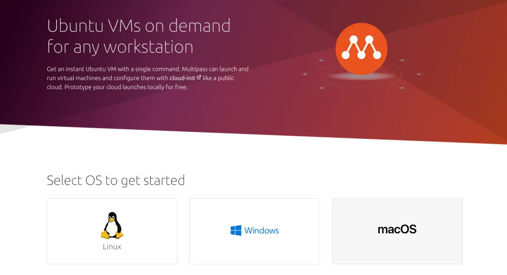
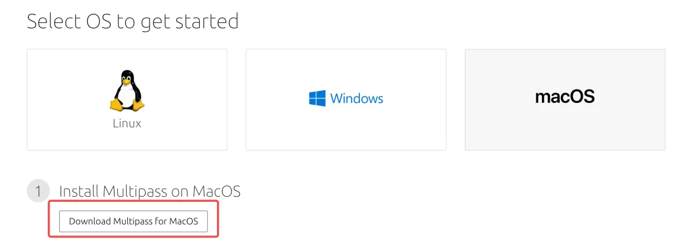
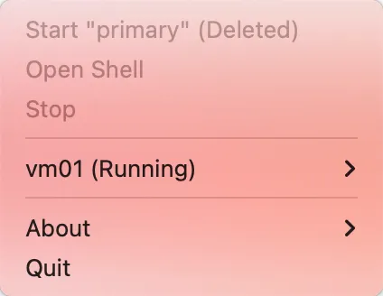

# Multipass

它可以快速在电脑上快速搭建一个轻量级的虚拟机，并且相比于 **Vmware** 更加轻量，只需一行命令快速创建 **Ubuntu** 虚拟机。

**Multipass** 是一个轻量虚拟机管理器，是由 **Ubuntu** 运营公司 **Canonical** 所推出的开源项目。运行环境支持 **Linux**、**Windows**、**macOS**。在不同的操作系统上，使用的是不同的虚拟化技术。在 **Linux** 上使用的是 **KVM**、**Window** 上使用 **Hyper-V**、**macOS** 中使用 **HyperKit** 以最小开销运行VM，支持在笔记本模拟小型云。

同时，**Multipass** 提供了一个命令行界面来启动和管理 **Linux** 实例。下载一个全新的镜像需要几秒钟的时间，并且在几分钟内就可以启动并运行 **VM**。（直呼好家伙，大大降低的我们安装虚拟机的成本了）

> Multipass官网：https://multipass.run/



## 开始使用

在使用 **Multipass** 之前 ，首先需要安装 **Multipass** 工具，可以打开官网进行下载

```
https://multipass.run/
```

选择对应的操作系统，因为我的是 **Mac** 电脑，所以选择 MacOS，点击 **Download** 开始下载



选择对应版本安装

如果电脑装了 **brew** 可以直接命令行下载安装:

```
brew cask install multipass
```

下载安装成功后, 执行以下命令可以查看当前软件版本:

```
multipass --version
```

安装成功后，点击运行，即可打开 **Multipass** 客户端，这里能够快速的通过 **Open Shell** 创建和启动一个虚拟机



Multipass客户端

下面，我们来介绍如何通过命令的方式，创建一台虚拟机

创建Ubuntu虚拟机
-----------

首先，通过以下指令查看可供下载的 **Ubuntu** 镜像

```
multipass find
```

运行成功后，可以看到下面的这些镜像列表，包含各种版本的

```
Image                       Aliases           Version          Descriptioncore                        core16            20200818         Ubuntu Core 16core18                                        20200812         Ubuntu Core 1818.04                       bionic            20211109         Ubuntu 18.04 LTS20.04                       focal,lts         20211118         Ubuntu 20.04 LTS21.04                       hirsute           20211119         Ubuntu 21.0421.10                       impish            20211103         Ubuntu 21.10appliance:adguard-home                        20200812         Ubuntu AdGuard Home Applianceappliance:mosquitto                           20200812         Ubuntu Mosquitto Applianceappliance:nextcloud                           20200812         Ubuntu Nextcloud Applianceappliance:openhab                             20200812         Ubuntu openHAB Home Applianceappliance:plexmediaserver                     20200812         Ubuntu Plex Media Server Applianceanbox-cloud-appliance                         latest           Anbox Cloud Applianceminikube                                      latest           minikube is local Kubernetes
```

下载最新版的 **Ubuntu** 镜像并运行，初次创建时需要下载 **Ubuntu** 镜像，网络畅通的情况下，稍等片刻即可。

```
multipass launch -n vm01 -c 1 -m 1G -d 10G
```

自定义配置创建可以参考如下方式:

```
-n, --name: 名称-c, --cpus: cpu核心数, 默认: 1-m, --mem: 内存大小, 默认: 1G-d, --disk: 硬盘大小, 默认: 5G
```

操作虚拟机
-----

### 查看虚拟机列表

虚拟机创建完成后，可以使用 **multipass list** 命令进行查看虚拟机列表

```
% multipass listName                    State             IPv4             Imagevm01                    Running           192.168.64.2     Ubuntu 20.04 LTS
```

可以看到目前正在运行一台 **Ubuntu 20.04** 版本的虚拟机，并且对应的 **IP** 地址为 **192.168.64.2**

### 外部操作虚拟机

通过 **multipass exec** 命令在实例内执行给定的命令。第一个参数是运行命令的实例，也就是 **vm01**

我们通过 **exec** 命令，就可以在外部操作刚刚创建的虚拟机，例如查看内部所处的目录，执行 **pwd** 命令

```
# multipass exec vm01 pwd/home/ubuntu
```

### 查看虚拟机信息

通过 **multipass info** 命令，即可查看当前运行的虚拟机信息

```
# multipass info vm01Name:           vm01State:          RunningIPv4:           192.168.64.2Release:        Ubuntu 20.04.3 LTSImage hash:     91740d72ffff (Ubuntu 20.04 LTS)Load:           0.00 0.00 0.00Disk usage:     1.3G out of 9.5GMemory usage:   170.9M out of 1.9GMounts:         --
```

### 进入虚拟机

通过 **multipass shell** 命令，即可进入到虚拟机内部

```
multipass shell vm01
```

运行后的结果如下所示，可以看到目前虚拟机的一些系统配置信息，以及内存和磁盘的使用情况


进入虚拟机内部

同时会运行一个新的 **Ubuntu** 系统，此时便进入到了**Ubuntu** 环境中, 在里面可以执行相关的 **linux** 指令

当然如果不想进入系统内部，也可以通过上述提到的 **multipass exce** 命令，来操作 **Ubuntu** 系统

首先执行下面命令，给系统设置一个 **root** 密码，设置好密码后，使用 **su root** 切换到 **root** 用户

```
# 设置密码sudo passwd# 切换 rootsu root
```

**ubuntu** 是使用 **apt-get** 来进行包管理的，首先更新一下 **apt-get**，然后安装 **nginx**

```
# 更新aptapt-get update# 安装 nginxapt-get install nginx
```

安装好 **nginx** 后，可以到 /etc/nginx 目录即可看到刚刚的 **nginx** 配置信息

```
root@vm01:/lost+found# cd /etc/nginx/root@vm01:/etc/nginx# lsconf.d        fastcgi_params  koi-win     modules-available  nginx.conf    scgi_params      sites-enabled  uwsgi_paramsfastcgi.conf  koi-utf         mime.types  modules-enabled    proxy_params  sites-available  snippets       win-utf
```

下面我们可以测试一下，**nginx** 是否安装成功，在 **mac** 上打开浏览器，输入虚拟机的 **ip** 地址 **192.168.64.2**


nginx安装成功

可以看出，目前 **nginx** 已经成功运行了，后续的话，可能会考虑在上面部署更多的应用，感兴趣的小伙伴欢迎关注～

### 挂载数据卷

**multipass** 还提供和 **Docker** 一样的挂载数据卷的功能，能够与外部宿主机的文件保持同步。

```
# 挂载格式multipass mount 宿主机目录  实例名:虚拟机目录
```

下面，我在用户的目录下，创建一个 **hello** 目录

```
# 创建hello目录mkdir hello# 挂载multipass mount /Users/moxi/hello  vm01:/hello
```

挂载完成后，我们回到实例 vm01 中，可以看出多了一个 **hello** 文件夹，说明已经成功挂载～


挂载成功

因此，以后在 **vm01** 的 **hello文件夹** 中创建的文件，都会在的宿主机的 **hello 文件夹**同步显示

### 卸载数据卷

如果以后不需要用到挂载了，可以使用 **unmount** 命令卸载

```
#卸载数据卷multipass umount 容器名
```

### 传输文件

除了使用上述的 **mount** 挂载卷的方式实现文件的交互，同时还可以通过 transfer 命令，将宿主机的文件，发送到虚拟机内部

```
multipass transfer 主机文件 容器名:容器目录
```

例如，将 **hello.txt** 发送到

```
multipass transfer hello.txt vm01:/home/ubuntu/
```

### 删除和释放实例

使用下面的命令，可以开启、停止、删除和释放实例

```
# 启动实例multipass start vm01# 停止实例multipass stop vm01# 删除实例（删除后，还会存在）multipass delete vm01# 释放实例（彻底删除）multipass purge vm01
```

### 容器配置自动化

为了保持开发环境和线上环境一致性 同时节省部署时间 **multipass** 给我们提供了 **\--cloud-init** 选项进行容器启动初始化配置:

```
multipass launch --name ubuntu --cloud-init config.yaml
```

上面 **config.yaml** 则是容器的初始化配置文件，例如，我们想在初始化容器的时候，自动下载安装 **Node.js**，内容如下：

```
#cloud-configruncmd:  - curl -sL https://deb.nodesource.com/setup_12.x | sudo -E bash -  - sudo apt-get install -y nodejs
```

`runcmd` 可以指定容器 **首次启动** 时运行的命令

> 凡是用户自定义的cloud-init的配置文件,必须以#cloud-config开头，这是cloud-init识别它的方式。

**yaml** 配置文件可以参考下面的文章

```
https://cloudinit.readthedocs.io/en/latest/topics/examples.html?highlight=lock-passwd#including-users-and-groups
```

更多关于 **multipass** 的高阶的技巧，欢迎访问 **multipass** 官方文档

```
https://multipass.run/docs/
```

好了，本期关于 **Multipass** 的基础学习就到这里了，感兴趣的小伙伴环境下载自己动手学习呢～

总结
--

使用了一阵子后，**Multipass** 在使用起来很简洁直观，在整体操作上和 **docker** 类似，如果想在自己电脑上快速搭建一个 **Linux** 系统用于学习的话，选择使用 **Multipass** 还是非常方便的。

唯一不足的地方就是，**Multipass** 是由 **Ubuntu** 背后的 **Canonical** 公司开发的，因此 **Multipass** 所使用的镜像也都是 **Ubuntu** 镜像（这也可以理解，毕竟支持自家的产品），不过对于习惯了使用 **CentOS** 的用户来说，还是用些许不太习惯。不过瑕不掩瑜，**Multipass** 在我看来还是一款非常棒的软件～

> https://mp.weixin.qq.com/s/gy6dVHvNy495bqov6JOAdA